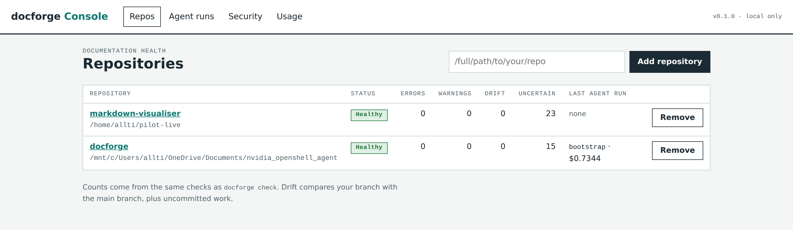
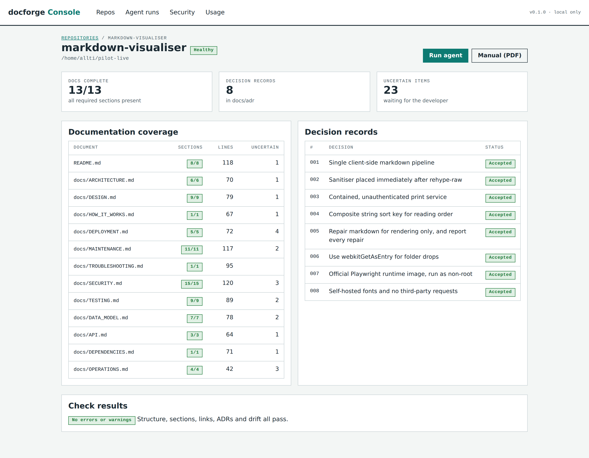
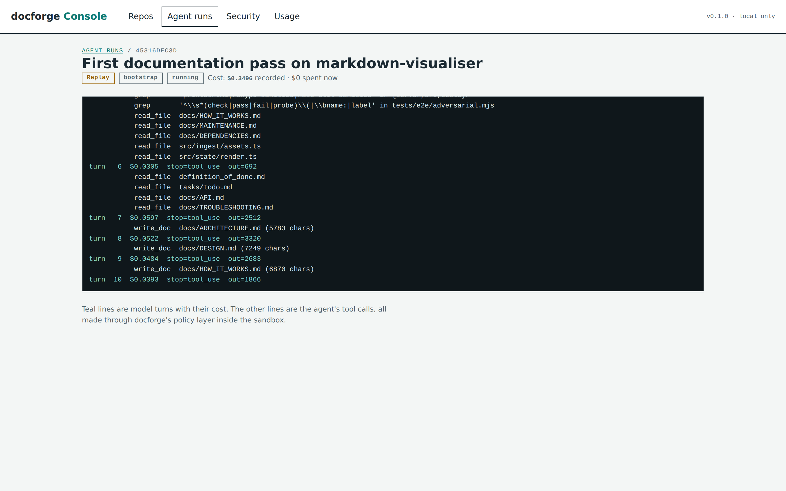
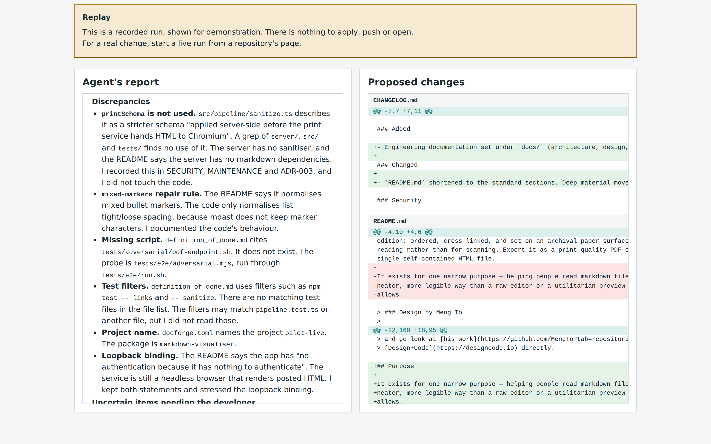
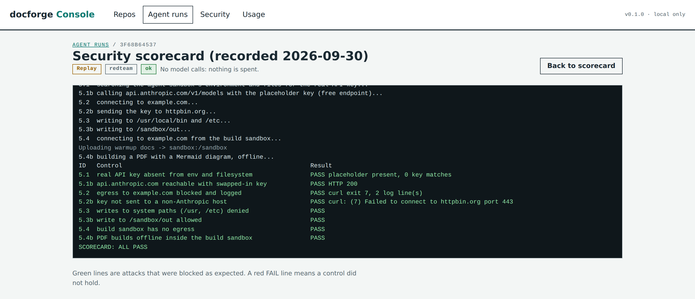
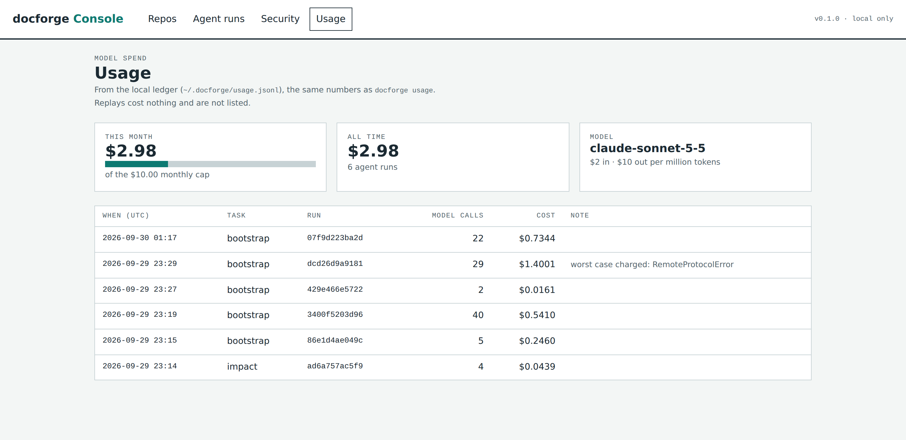

# docforge

## Purpose

docforge is a command-line tool for keeping engineering documentation in a repository accurate ("docs-as-code"). It scaffolds a fixed documentation set, checks it deterministically (structure, sections, links, ADRs, drift between code and docs), runs an AI agent inside a sandbox to *propose* documentation patches, and builds the Markdown into a versioned PDF manual.

An optional local web UI, **docforge Console** (`docforge serve`), drives the same commands and sandbox scripts for demos (see [Screenshots](#screenshots)).

Design background: `specification.json` (features, contracts, the console spec), `definition_of_done.md` (a testable criterion and its check for every task) and `progress_tracking.json` (the task ledger, T0–T17).

<!-- sources: pyproject.toml, src/docforge/cli.py, specification.json, definition_of_done.md, progress_tracking.json -->

## Technologies

- Python 3.12+, [Typer](https://typer.tiangolo.com/) for the CLI, the `anthropic` SDK for the agent, built with hatchling and managed with `uv`.
- External tools for the PDF manual: pandoc, tectonic (LaTeX), mermaid-cli (`mmdc`).
- OpenShell and Docker for the agent and build sandboxes.
- Dev tooling declared: pytest, ruff, mypy (strict), jsonschema.

See [docs/DEPENDENCIES.md](docs/DEPENDENCIES.md).

<!-- sources: pyproject.toml, init.sh, sandbox/build.Dockerfile -->

## Architecture at a Glance

Commands: `init`, `check`, `build`, `agent {impact,adr,bootstrap}`, `apply`, `usage`, `serve`. The agent can only read the repository and *stage* Markdown writes; a human reviews `docforge.patch` and `docforge apply` commits it to a new branch. CI runs only the deterministic `check`; the model is never called in CI. Details in [docs/ARCHITECTURE.md](docs/ARCHITECTURE.md).

In plain terms: the agent works on its own inside a locked sandbox, and a person approves every step that leaves it.


<!-- sources: src/docforge/cli.py, .github/workflows/docforge.yml, src/docforge/apply.py, src/docforge/console/publish.py, sandbox/redteam.sh -->

## Screenshots

docforge Console (`docforge serve`), following the 5-minute route in [docs/DEMO.md](docs/DEMO.md). The run shown is a free replay of a real recorded run on [markdown-visualiser](https://github.com/beese54/markdown-visualiser/pull/1).

**Repositories.** Documentation health from the same checks as `docforge check`.



**Repository detail.** 13 of 13 docs complete, and the 8 decision records the agent wrote.



**Agent run.** The sandboxed agent reads the code and drafts docs. Teal lines are model turns with their cost.



**Review.** The agent's report next to its proposed changes. Here it flags a real security gap it found in the code (an unused sanitiser schema) instead of papering over it.



**Security scorecard.** 8 checks, all passing: 5 attacks on the sandboxes are blocked, and 3 checks confirm the allowed paths still work.



**Usage.** Every model call is recorded, with a hard monthly cap.



<!-- sources: docs/images/console/, docs/DEMO.md, src/docforge/console/ -->

## Prerequisites

Run `./init.sh` (Linux/WSL). It reports, and does not install, missing: python3 3.12+, uv, git, pandoc, tectonic, Node >= 20, mmdc, pdftotext (poppler-utils), docker, openshell. It then runs `uv sync`.

<!-- sources: init.sh -->

## Local Development

```bash
./init.sh            # check prerequisites + create the venv (default ~/.venvs/docforge)
./dev.sh docforge check      # run any command in the dev environment
./dev.sh ruff check src tests
./dev.sh mypy src
```

`dev.sh` is `uv run` with `UV_PROJECT_ENVIRONMENT` pointed at the venv outside the repo. Model calls need `ANTHROPIC_API_KEY` (or the OpenShell provider); see [docs/MAINTENANCE.md](docs/MAINTENANCE.md).

**Web UI for demos:** `./dev.sh docforge serve` starts docforge Console on 127.0.0.1:8765. Open the printed link. Walkthrough: [docs/DEMO.md](docs/DEMO.md).

<!-- sources: dev.sh, init.sh, pyproject.toml, src/docforge/cli.py -->

## Running Tests

```bash
./dev.sh pytest -q
```

See [docs/TESTING.md](docs/TESTING.md).

<!-- sources: dev.sh, pyproject.toml, tests/conftest.py -->

## Deployment

docforge is not a deployed service. It is installed as a Python wheel; CI installs it with `uvx` from a git URL, and the sandbox images are built by `sandbox/build-images.sh`. See [docs/DEPLOYMENT.md](docs/DEPLOYMENT.md).

<!-- sources: .github/workflows/docforge.yml, sandbox/build-images.sh -->

## Documentation

- [Architecture](docs/ARCHITECTURE.md), [Design](docs/DESIGN.md), [How it works](docs/HOW_IT_WORKS.md)
- [Data model](docs/DATA_MODEL.md), [API / CLI](docs/API.md), [Security](docs/SECURITY.md)
- [Deployment](docs/DEPLOYMENT.md), [Testing](docs/TESTING.md), [Operations](docs/OPERATIONS.md), [Maintenance](docs/MAINTENANCE.md)
- [Troubleshooting](docs/TROUBLESHOOTING.md), [Dependencies](docs/DEPENDENCIES.md), [Console demo](docs/DEMO.md)
- Decisions: [docs/adr/](docs/adr/001-human-reviewed-patches-only.md)
- [CHANGELOG](CHANGELOG.md)

<!-- sources: docforge.toml -->
