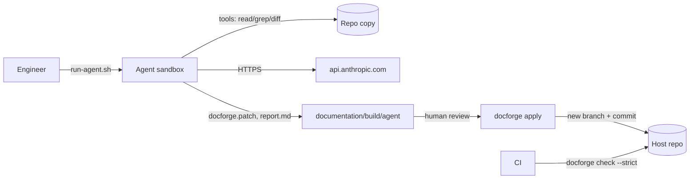

# Architecture

> Which components exist and how information flows between them.

## Overview

docforge is a single Python package (`src/docforge`) exposing one CLI. It has no server, database or long-running process. It works on a target git repository (its own, for self-documentation) and on a small set of files there: `docforge.toml`, `docs/`, `README.md`, `CHANGELOG.md`, `documentation/`.

<!-- sources: pyproject.toml, src/docforge/cli.py, src/docforge/config.py -->

## Components

| Component | Role |
|---|---|
| `cli.py` | Typer wiring only; one function per command. |
| `config.py` | Loads and strictly validates `docforge.toml`; defines the agent write allowlist `AGENT_WRITABLE`. |
| `doctypes.py` | Table of the documentation set and required H2 sections. Used by `init` (skeletons), `check` and the agent system prompt. |
| `init.py` | Scaffolds missing files and guesses the impact map from the repository layout. |
| `checks.py`, `markdown.py`, `findings.py` | Deterministic checks (structure, sections, links, ADRs, uncertain markers). `markdown.py` and `findings.py` were not read in detail. |
| `drift.py`, `git.py`, `globs.py` | Compares code changes against the impact map; thin git CLI wrappers. |
| `agent/` | Model loop (`runner.py`), tool policy (`policy.py`), spend limits (`budget.py`), prompts, patch generation (`patch.py`). |
| `apply.py` | Applies a reviewed patch on a new branch, re-checking paths. |
| `build.py`, `templates/docforge.lua` | Markdown to pandoc to LaTeX to PDF; Lua filter renders Mermaid and rewrites cross-file links. |
| `sandbox/` | OpenShell policies, Docker images and scripts for running the agent and the PDF build in isolation. |

<!-- sources: src/docforge/*.py, src/docforge/agent/*.py, src/docforge/templates/docforge.lua, sandbox/ -->

## Information Flow

1. The agent only touches the repository through six tools (`list_files`, `read_file`, `grep`, `git_diff`, `write_doc`, `finish`). Writes are held in memory.
2. At the end, staged writes become a unified diff (`docforge.patch`) plus `report.md`, `trace.log`, `policy.log`, `run.json`.
3. A human reviews, then `docforge apply` checks the paths again and commits on a new branch. Nothing is pushed.

Workflow detail: [HOW_IT_WORKS.md](HOW_IT_WORKS.md).

<!-- sources: src/docforge/agent/runner.py, src/docforge/agent/policy.py, src/docforge/agent/patch.py, src/docforge/apply.py, sandbox/run-agent.sh -->

## External Systems

- Anthropic API (`api.anthropic.com:443`), model `claude-sonnet-5-5`, used only by `docforge agent`.
- git CLI, pandoc, tectonic, mermaid-cli (`mmdc`).
- OpenShell (sandbox runtime) and Docker.
- GitHub Actions (CI). The workflow installs docforge from `github.com/beese54/docforge`; that repository is public since 2026-09-30, and CI installs from it.

<!-- sources: src/docforge/agent/budget.py, .github/workflows/docforge.yml, STATUS-2026-09-30.md, sandbox/anthropic-profile.yaml -->

## Infrastructure

No hosted infrastructure. Local state is the usage ledger `~/.docforge/usage.jsonl` (override with `DOCFORGE_HOME`) and build output under `documentation/build/` (git-ignored by `init`). Two Docker images, `docforge-agent:<version>` and `docforge-build:<version>`, run under OpenShell.

<!-- sources: src/docforge/agent/budget.py, src/docforge/init.py, sandbox/build-images.sh -->

## Deployment Architecture

See [DEPLOYMENT.md](DEPLOYMENT.md). In short: a wheel built with `uv build`; the agent image installs it with pip; CI uses `uvx --from <git url>`.

<!-- sources: sandbox/build-images.sh, sandbox/agent.Dockerfile, .github/workflows/docforge.yml -->
